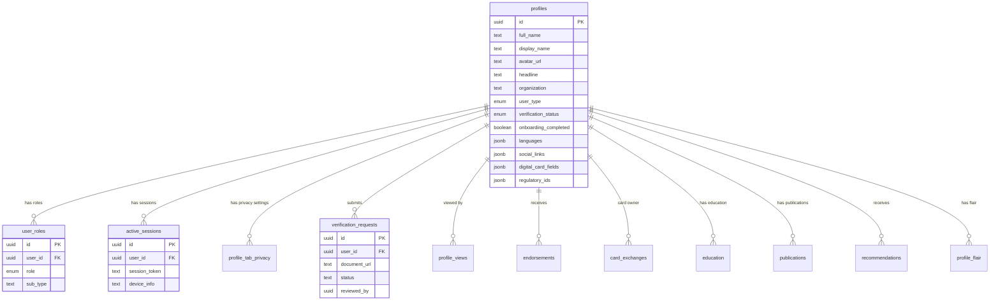
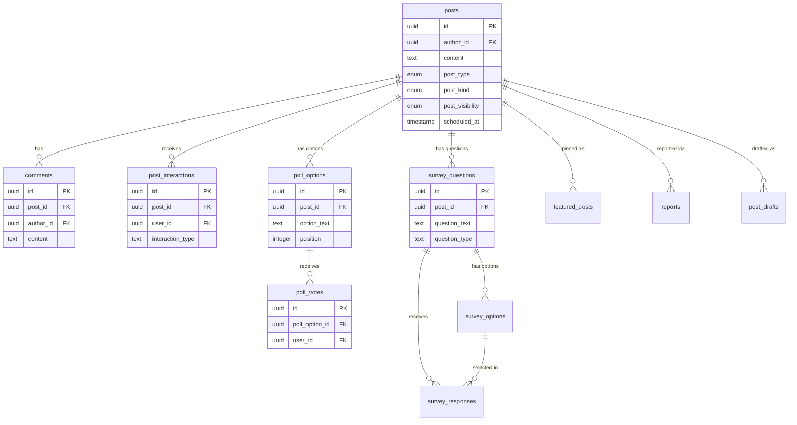
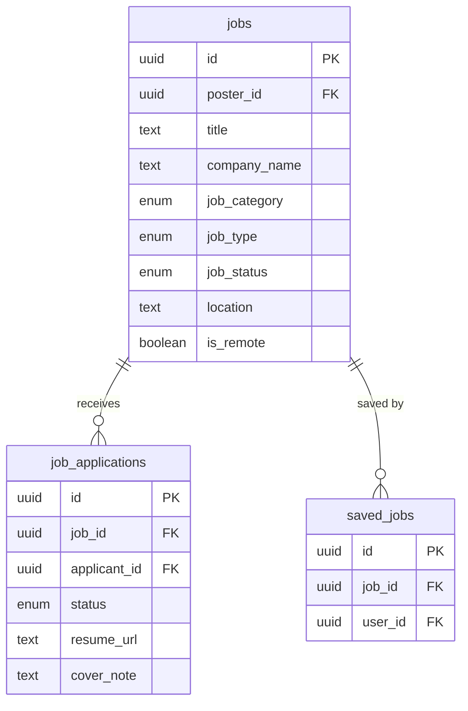
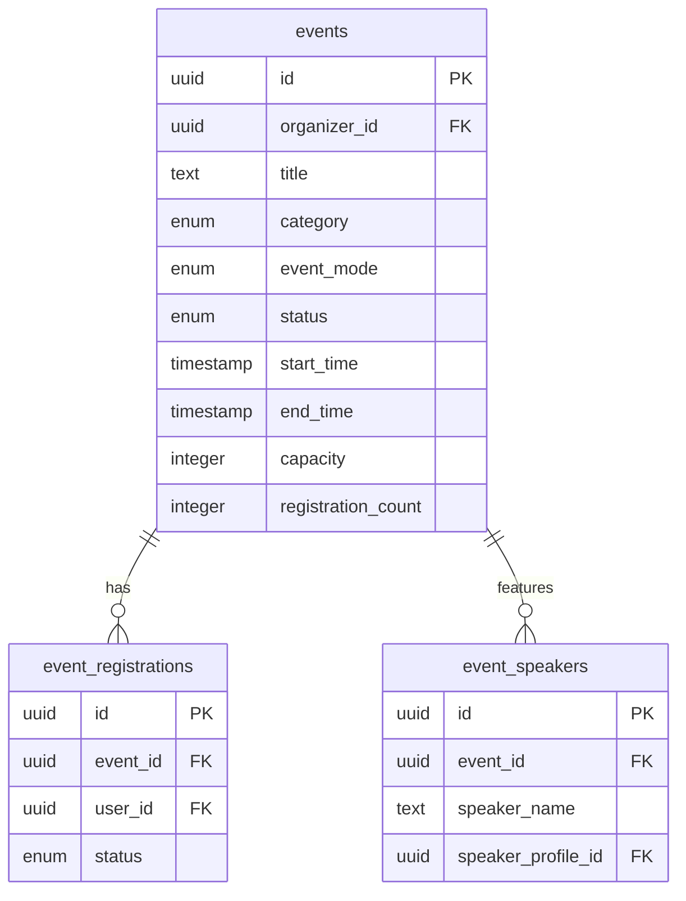
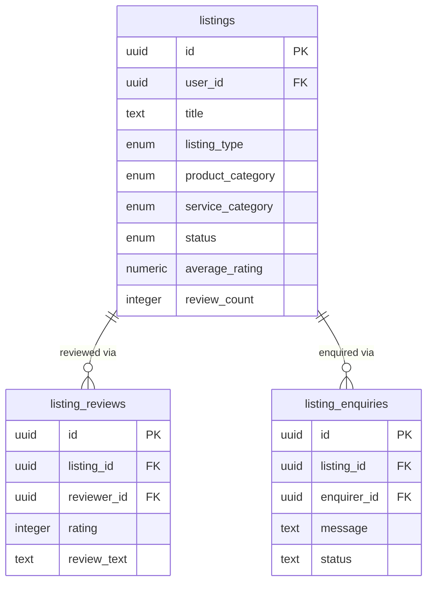
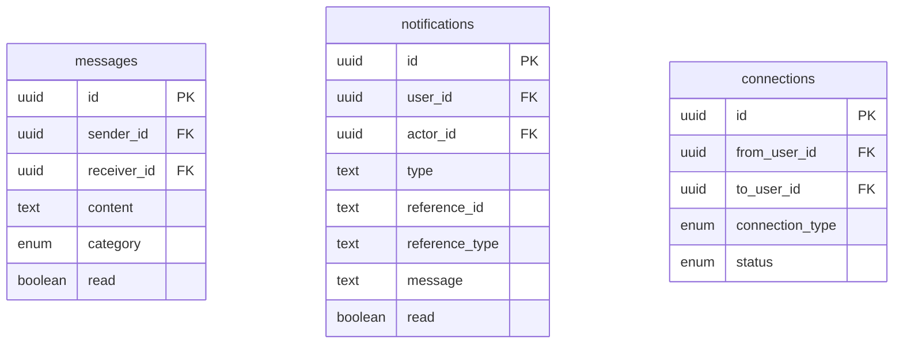
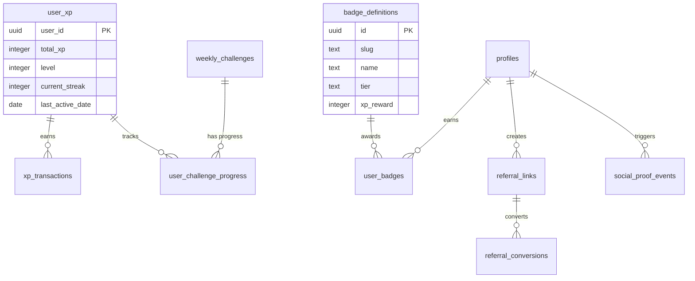
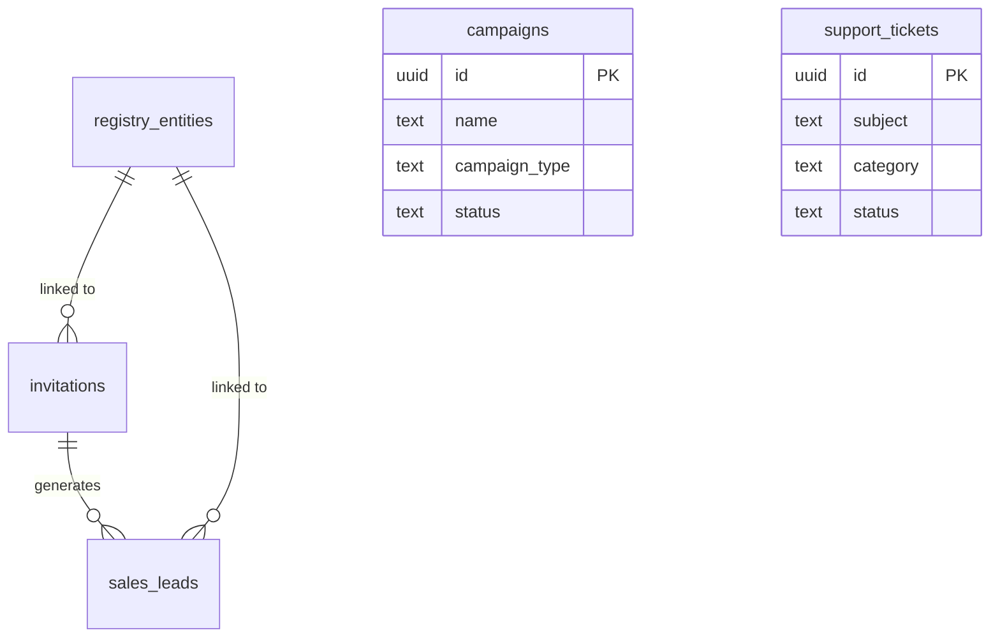

# FindOO — Architecture Guide

> System overview, module map, data flow patterns, and context dependency graph.

---

## High-Level Architecture

```
┌──────────────────────────────────────────────────────────────┐
│                        React SPA (Vite)                      │
│                                                              │
│  ┌────────────┐   ┌──────────────┐   ┌───────────────────┐  │
│  │  Pages      │   │  Contexts     │   │  UI Components    │  │
│  │  (50 Routes)│──▶│  RoleContext   │──▶│  shadcn/ui (53)   │  │
│  │  /feed      │   │  ThemeProvider │   │  Module-specific  │  │
│  │  /jobs      │   └──────┬───────┘   │  Skeletons         │  │
│  │  /events    │          │           └───────────────────┘  │
│  │  /showcase  │   ┌──────┴───────┐                          │
│  │  /profile   │   │  Custom Hooks │                          │
│  │  /messages  │   │  (25 hooks)   │                          │
│  │  /admin     │   │  useFeedPosts │                          │
│  │  /vault     │   │  useJobs      │                          │
│  │  /discover  │   │  useEvents    │                          │
│  └─────┬──────┘   │  useListings  │                          │
│        │          │  useVault     │                          │
│        │          └──────┬───────┘                          │
│        │                 │                                   │
│        │          ┌──────┴───────┐                          │
│        └─────────▶│ TanStack     │                          │
│                   │ React Query  │                          │
│                   └──────┬───────┘                          │
│                          │                                   │
│                   ┌──────┴───────┐                          │
│                   │ Supabase SDK │                          │
│                   └──────┬───────┘                          │
└──────────────────────────┼───────────────────────────────────┘
                           │
              ┌────────────┴────────────┐
              │    Lovable Cloud        │
              │    (Supabase Backend)   │
              │                         │
              │  ├── PostgreSQL (60+ tables)
              │  ├── Auth (email+password)
              │  ├── Storage (6 buckets)
              │  ├── Edge Functions (9)
              │  ├── Realtime (messages, notifications)
              │  ├── RLS Policies (all tables)
              │  └── DB Functions (40)
              └─────────────────────────┘
```

---

## Module Map

FindOO is organized into 13+ feature modules, each with its own page, hook(s), and component folder:

| Module         | Route(s)                  | Hook(s)                                      | Component Folder         |
| -------------- | ------------------------- | -------------------------------------------- | ------------------------ |
| **Feed**       | `/feed`                   | `useFeedPosts`, `usePostInteractions`, `useDrafts`, `useScheduledPosts`, `useTrendingPosts`, `useViralPosts`, `useTrendingHashtags` | `components/feed/`       |
| **Profile**    | `/profile`, `/profile/:id`| `useConnectionActions`, `usePostInteractions`, `useProfileFlair`, `useTabPrivacy` | `components/profile/`    |
| **Network**    | `/network`                | `useConnectionActions`                        | `components/network/`    |
| **Jobs**       | `/jobs`                   | `useJobs` (11 exports)                        | `components/jobs/`       |
| **Events**     | `/events`                 | `useEvents` (9 exports)                       | `components/events/`     |
| **Showcase**   | `/showcase`               | `useListings` (8 exports)                     | `components/directory/`  |
| **Messages**   | `/messages`               | (inline in page — Supabase Realtime)          | —                        |
| **Vault**      | `/vault`                  | `useVault`                                    | `components/vault/`      |
| **Analytics**  | `/analytics`              | `useFeedPosts`, `usePostInteractions`         | —                        |
| **Discover**   | `/discover`               | `useConnectionActions`, `useTrustCircleIQ`    | `components/discover/`   |
| **Bookmarks**  | `/bookmarks`              | `usePostInteractions`, `useJobs`, `useEvents` | —                        |
| **Leaderboard**| `/leaderboard`            | `useGamification`                             | `components/gamification/` |
| **Admin**      | `/admin`                  | `useAdmin`, `useInvitations` (15+ exports)    | `components/admin/`      |

---

## Entity-Relationship Diagram

The database contains 60+ tables organized into 8 domains. Foreign keys are shown as arrows.

### Core User Domain



### Content Domain (Feed)



### Jobs Domain



### Events Domain



### Showcase (Directory) Domain



### Messaging and Notifications



### Gamification Domain



### Growth Domain



### Supporting Tables

| Table | Domain | Purpose |
| --- | --- | --- |
| `post_drafts` | Feed | Unsaved post drafts per user |
| `blog_posts` | CMS | Public blog articles (admin-managed) |
| `blog_poll_options` / `blog_poll_votes` | CMS | Blog post polls |
| `blog_survey_questions` / `blog_survey_options` / `blog_survey_responses` | CMS | Blog post surveys |
| `file_uploads` | Storage | Upload records for all storage buckets |
| `reports` | Moderation | User-submitted content/user reports |
| `audit_logs` | Admin | Administrative action audit trail |
| `endorsements` | Profile | Skill endorsements between users |
| `card_exchanges` | Profile | Digital card view/save tracking |
| `profile_views` | Profile | Profile view analytics |
| `profile_tab_privacy` | Privacy | Tab-level privacy controls per user |
| `education` | Profile | User education history |
| `publications` | Profile | User publications and research |
| `recommendations` | Profile | Peer recommendations |
| `intent_signals` | Discovery | User intent tracking for TrustCircle IQ |
| `introductions` | Network | Warm introductions between users |
| `affinity_scores` | Discovery | Computed affinity scores for ranking |
| `email_send_log` | Email | Transactional email delivery log |
| `email_send_state` | Email | Email queue processing state |
| `email_unsubscribe_tokens` | Email | Unsubscribe token management |
| `suppressed_emails` | Email | Bounced/suppressed email list |

---

## Context Dependency Graph

```
App
 ├── QueryClientProvider (TanStack)
 │    └── All hooks use this for server state
 ├── ThemeProvider (next-themes)
 │    └── Light/Dark mode toggle
 ├── RoleProvider (RoleContext)
 │    ├── Fetches user_roles from DB on auth
 │    ├── Provides: activeRole, hasRole(), userId
 │    └── Used by: useEvents, useJobs, ProtectedRoute, AppNavbar
 └── TooltipProvider (Radix)
```

### RoleContext Flow

```
Auth Event (sign in)
  → getSession()
  → fetch user_roles WHERE user_id = uid
  → Auto-select highest-priority role: issuer > intermediary > investor
  → Persist choice in localStorage (findoo_active_role)
  → Components use useRole() to access activeRole, hasRole()
```

---

## Data Flow Patterns

### 1. Standard CRUD (Jobs, Events, Listings)

```
Page Component
  → useJobs(filters)                    // TanStack useQuery
    → supabase.from("jobs").select()    // Filtered query
    → Batch-fetch related profiles      // Avoid N+1
    → Return enriched data
  → useCreateJob()                      // TanStack useMutation
    → supabase.from("jobs").insert()
    → invalidateQueries(["jobs"])       // Refetch list
    → toast.success()
```

### 2. Optimistic Updates (Feed Interactions)

```
User clicks "Like"
  → setLiked(true)                          // Instant UI update
  → optimisticUpdateFeedCache()             // Patch TanStack cache in-place
    → Update infinite query pages
    → Update trending-posts, viral-posts caches
  → supabase.from("post_interactions").insert()
  → On error:
    → setLiked(false)                       // Rollback local state
    → optimisticUpdateFeedCache() (reverse) // Rollback cache
    → toast.error()
```

### 3. Batch Loading (Post Interactions)

```
10 PostCards mount simultaneously
  → Each calls batchLoadInteraction(postId, userId)
  → Requests queue for 50ms
  → Single DB query: SELECT ... WHERE user_id = X AND post_id IN (...)
  → Results dispatched to individual Promises
```

### 4. Infinite Scroll (Feed)

```
useFeedPosts()
  → useInfiniteQuery with get_feed_posts RPC
  → PAGE_SIZE = 15
  → getNextPageParam: offset = sum of all page lengths
  → IntersectionObserver triggers fetchNextPage
  → flatPosts = pages.flat() for simple consumers
```

### 5. Realtime (Messages, Notifications)

```
useNotifications()
  → Initial load: SELECT * FROM notifications WHERE user_id = X
  → Subscribe: supabase.channel("notifications-realtime")
    → postgres_changes INSERT on notifications WHERE user_id = X
    → Prepend to local state + increment unreadCount
```

### 6. TrustCircle IQ (Affinity Ranking)

```
useTrustCircleIQ()
  → Calls compute_trustcircle_iq(viewer_id) RPC
  → Multi-factor scoring: role_weight × intent × trust_proximity × activity × freshness
  → 5-tier circle assignment (Inner → Primary → Secondary → Tertiary → Ecosystem)
  → Results cached in affinity_scores table
  → Used by: Discover, Network suggestions, Showcase "Suggested" tab
```

### 7. Input Sanitization

```
User submits content (post, comment, message)
  → sanitizeContent(rawText) via lib/sanitize.ts
    → DOMPurify.sanitize(input, { ALLOWED_TAGS: [...] })
  → Sanitized content sent to Supabase
```

### 8. Action Throttling

```
User rapidly clicks "Like"
  → throttle(toggleLike, 500ms) via lib/throttle.ts
  → First click executes immediately
  → Subsequent clicks within 500ms are silently dropped
  → Prevents API flooding and duplicate interactions
```

---

## Database Function Map

| Function                       | Type     | Purpose                                         |
| ------------------------------ | -------- | ----------------------------------------------- |
| `get_feed_posts`               | RPC      | Paginated feed with author profiles + counts     |
| `get_conversations`            | RPC      | Conversation list with last message + unread     |
| `get_leaderboard`              | RPC      | XP-based user leaderboard                        |
| `compute_trustcircle_iq`       | RPC      | Multi-factor affinity scoring for discovery      |
| `has_role`                     | RPC      | Check if user has a specific role                |
| `check_rate_limit`             | RPC      | Generic rate limiter (posts, messages, connections) |
| `enforce_session_limit`        | RPC      | Evict oldest sessions beyond max                 |
| `cleanup_stale_sessions`       | RPC      | Remove sessions inactive > 7 days                |
| `cleanup_old_intent_signals`   | RPC      | Remove intent signals older than 30 days         |
| `date_of`                      | RPC      | Extract date from timestamp (immutable)          |
| `resolve_flair_from_level`     | RPC      | Map XP level to profile flair settings           |
| `award_xp`                     | Internal | Award XP with streak multiplier + mentor bonus   |
| `track_challenge_progress`     | Internal | Update weekly challenge progress                 |
| `update_login_streak`          | Internal | Track daily login streaks                        |
| `create_notification`          | Internal | Insert notification (skips self-notifications)   |
| `enqueue_email`                | Internal | Queue email for async sending                    |
| `read_email_batch`             | Internal | Read batch of queued emails                      |
| `delete_email`                 | Internal | Delete processed email from queue                |
| `move_to_dlq`                  | Internal | Move failed email to dead letter queue           |
| `handle_new_user`              | Trigger  | Auto-create profile on auth.users INSERT         |
| `enforce_post_rate_limit`      | Trigger  | Max 10 posts/hour                                |
| `enforce_message_rate_limit`   | Trigger  | Max 60 messages/5 minutes                        |
| `enforce_connection_rate_limit`| Trigger  | Max 30 connection requests/hour                  |
| `notify_on_comment`            | Trigger  | Notify post author on new comment                |
| `notify_on_post_interaction`   | Trigger  | Notify post author on like/bookmark              |
| `notify_on_connection`         | Trigger  | Notify on follow/connection request              |
| `notify_on_connection_accepted`| Trigger  | Notify requester when accepted                   |
| `notify_on_message`            | Trigger  | Notify receiver on new message                   |
| `notify_on_verification_status_change` | Trigger | Notify user on verification approved/rejected |
| `notify_on_role_added`         | Trigger  | Notify user when a new role is assigned          |
| `update_listing_review_stats`  | Trigger  | Auto-update review_count/average_rating          |
| `update_updated_at`            | Trigger  | Auto-set updated_at on row update                |
| `update_post_drafts_updated_at`| Trigger  | Auto-set updated_at on draft update              |
| `sync_profile_flair_from_user_xp` | Trigger | Auto-sync flair on XP level change            |
| `gamify_on_post`               | Trigger  | Award XP on new post                             |
| `gamify_on_comment`            | Trigger  | Award XP on new comment                          |
| `gamify_on_like`               | Trigger  | Award XP on like given/received                  |
| `gamify_on_connection`         | Trigger  | Award XP on connection accepted                  |
| `gamify_on_event_registration` | Trigger  | Award XP on event registration                   |
| `gamify_on_endorsement`        | Trigger  | Award XP on endorsement given/received           |

---

## Storage Buckets

| Bucket              | Public | Used By                              |
| ------------------- | ------ | ------------------------------------ |
| `avatars`           | Yes    | Profile avatar uploads               |
| `banners`           | Yes    | Profile banner uploads               |
| `email-assets`      | Yes    | Email template images (logo, etc.)   |
| `verification-docs` | No     | KYC verification document uploads    |
| `resumes`           | No     | Job application resume uploads       |
| `vault`             | No     | Private user document vault          |

All uploads flow through the `upload-file` edge function for server-side validation.

---

## Route Architecture

### Public Routes (no auth required)

| Route | Page | Purpose |
| --- | --- | --- |
| `/` | Landing | Hero, features, social proof |
| `/auth` | Auth | Sign in / Sign up |
| `/reset-password` | ResetPassword | Password reset flow |
| `/install` | Install | PWA installation guide |
| `/blog` | Blog | Public blog listing |
| `/blog/:slug` | BlogPost | Individual blog article |
| `/about` | About | Company, Career, Press |
| `/contact` | Contact | Ask Us, Visit Us |
| `/explore` | Explore | Platform overview |
| `/compare` | Compare | Side-by-side platform comparisons |
| `/professionals` | ProfessionalDirectory | Public AMFI-registered directory |
| `/professionals/:registrationNumber` | ProfessionalProfile | Individual professional page |
| `/community-guidelines` | CommunityGuidelines | Guidelines + FAQs |
| `/terms` | Terms | Terms of service |
| `/privacy` | Privacy | Privacy policy |
| `/legal` | Legal | Combined legal pages |
| `/cookies` | CookiePolicy | Cookie policy |
| `/refund-policy` | RefundPolicy | Refund policy |
| `/accessibility` | Accessibility | Accessibility statement |
| `/transparency` | Transparency | Transparency report |
| `/helpdesk` | HelpDesk | Support articles |
| `/quick-links` | QuickLinks | Navigation grid |
| `/sitemap` | SiteMap | Full page index |
| `/card/:userId` | DigitalCard | Public digital business card |
| `/event-checkin/:eventId` | EventCheckin | Event QR check-in |
| `/vault/shared/:shareToken` | SharedVaultFile | Public shared file view |
| `/cost-report` | CostReport | Development cost analysis |
| `/scaling-report` | ScalingReport | Infrastructure scaling report |
| `/developer` | DeveloperDocs | In-app developer documentation |
| `/pitch` | PitchIndex | Pitch deck library |
| `/pitch/:deckId` | PitchDeck | Individual pitch presentation |

### Protected Routes (auth + onboarding required)

| Route | Page | Purpose |
| --- | --- | --- |
| `/feed` | Feed | Social content feed |
| `/profile` | Profile | Own profile |
| `/profile/:id` | Profile | Other user's profile |
| `/network` | Network | Connections & followers |
| `/discover` | Discover | People discovery |
| `/analytics` | PostAnalytics | Post engagement analytics |
| `/notifications` | Notifications | In-app notifications |
| `/messages` | Messages | Direct messaging |
| `/settings` | Settings | Account settings |
| `/showcase` | Directory (Showcase) | Product/service marketplace |
| `/bookmarks` | Bookmarks | Saved posts, jobs, events |
| `/leaderboard` | Leaderboard | XP-based ranking |
| `/jobs` | Jobs | Job board |
| `/events` | Events | Events listing |
| `/vault` | Vault | Document vault |
| `/admin` | Admin | Admin panel (admin role only) |
| `/onboarding` | Onboarding | First-time setup |

### Loading Strategy
- **Eager**: Landing, Auth, ResetPassword, Onboarding, NotFound, Install, Blog
- **Lazy** (`React.lazy`): All other routes — reduces initial bundle by ~60%

---

## Security Architecture

| Layer | Mechanism | Details |
| --- | --- | --- |
| **Database** | RLS Policies | All tables have row-level security |
| **Database** | Rate Limiting | Trigger-based limits on posts (10/hr), messages (60/5min), connections (30/hr) |
| **Server** | Edge Functions | File upload validation (type, size, bucket) |
| **Server** | Email Queue | Async email processing with DLQ and suppression list |
| **Client** | DOMPurify | XSS prevention on all user-generated content |
| **Client** | Action Throttling | 500ms-1s guards on rapid interactions |
| **Client** | Session Management | Max 3 concurrent sessions, 7-day stale cleanup |
| **Admin** | Audit Logging | Fire-and-forget logs for sensitive actions |
| **Admin** | RBAC | Admin-only routes and components |
