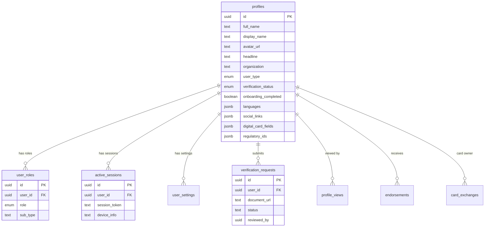
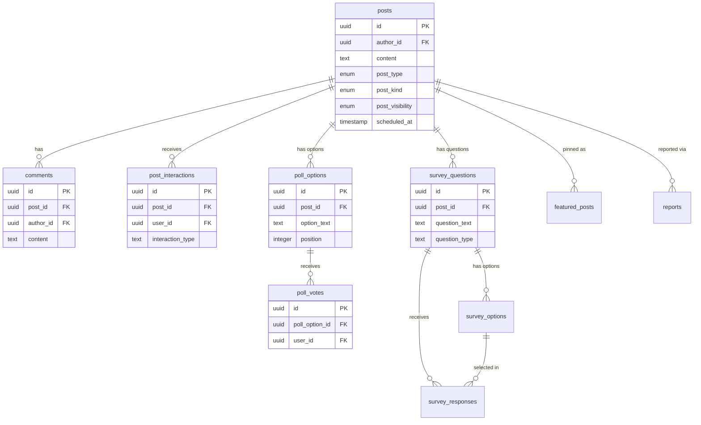
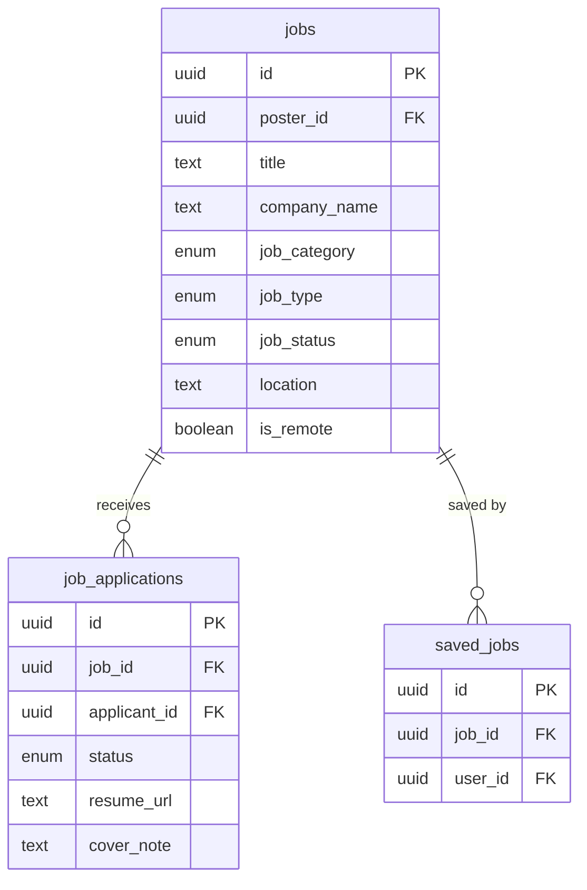
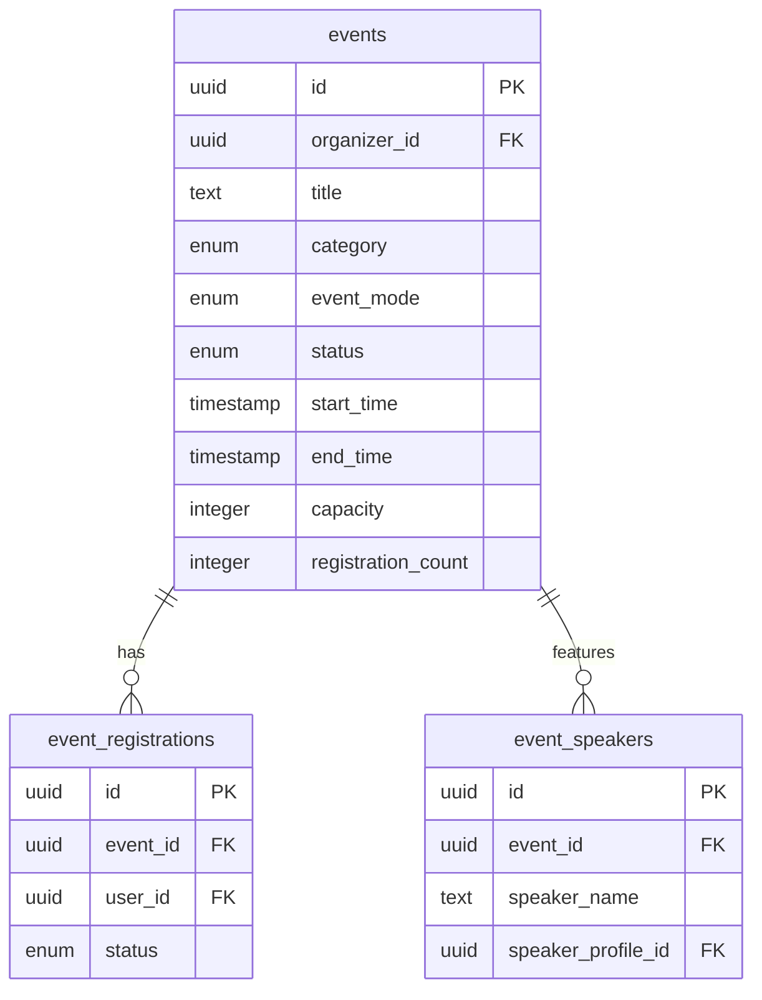
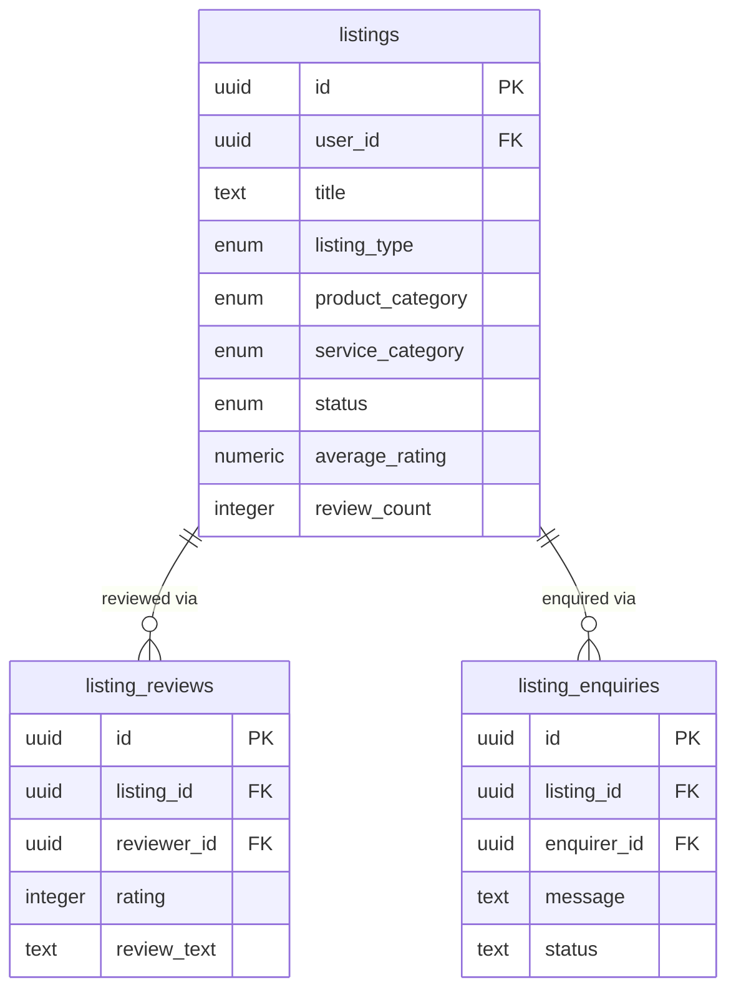
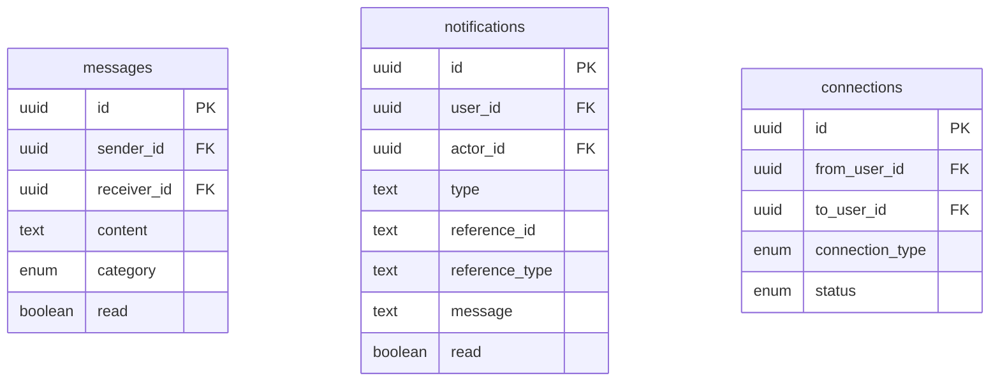

# FindOO — Architecture Guide

> System overview, module map, data flow patterns, and context dependency graph.

---

## High-Level Architecture

```
┌──────────────────────────────────────────────────────────────┐
│                        React SPA (Vite)                      │
│                                                              │
│  ┌────────────┐   ┌──────────────┐   ┌───────────────────┐  │
│  │  Pages      │   │  Contexts     │   │  UI Components    │  │
│  │  (Routes)   │──▶│  RoleContext   │──▶│  shadcn/ui base   │  │
│  │  /feed      │   │  ThemeProvider │   │  Module-specific  │  │
│  │  /jobs      │   └──────┬───────┘   │  Skeletons         │  │
│  │  /events    │          │           └───────────────────┘  │
│  │  /directory │   ┌──────┴───────┐                          │
│  │  /profile   │   │  Custom Hooks │                          │
│  │  /messages  │   │  useFeedPosts │                          │
│  │  /admin     │   │  useJobs      │                          │
│  └─────┬──────┘   │  useEvents    │                          │
│        │          │  useListings  │                          │
│        │          │  useVault     │                          │
│        │          └──────┬───────┘                          │
│        │                 │                                   │
│        │          ┌──────┴───────┐                          │
│        └─────────▶│ TanStack     │                          │
│                   │ React Query  │                          │
│                   └──────┬───────┘                          │
│                          │                                   │
│                   ┌──────┴───────┐                          │
│                   │ Supabase SDK │                          │
│                   └──────┬───────┘                          │
└──────────────────────────┼───────────────────────────────────┘
                           │
              ┌────────────┴────────────┐
              │    Lovable Cloud        │
              │    (Supabase Backend)   │
              │                         │
              │  ├── PostgreSQL (30+ tables)
              │  ├── Auth (email+password)
              │  ├── Storage (5 buckets)
              │  ├── Edge Functions (4)
              │  ├── Realtime (messages, notifications)
              │  ├── RLS Policies (all tables)
              │  └── DB Functions (17)
              └─────────────────────────┘
```

---

## Module Map

FindOO is organized into 10 feature modules, each with its own page, hook(s), and component folder:

| Module       | Route(s)                  | Hook(s)                                      | Component Folder         |
| ------------ | ------------------------- | -------------------------------------------- | ------------------------ |
| **Feed**     | `/feed`                   | `useFeedPosts`, `usePostInteractions`, `useDrafts`, `useScheduledPosts`, `useTrendingPosts`, `useViralPosts`, `useTrendingHashtags` | `components/feed/`       |
| **Profile**  | `/profile`, `/profile/:id`| `useConnectionActions`, `usePostInteractions` | `components/profile/`    |
| **Network**  | `/network`                | `useConnectionActions`                        | `components/network/`    |
| **Jobs**     | `/jobs`                   | `useJobs` (11 exports)                        | `components/jobs/`       |
| **Events**   | `/events`                 | `useEvents` (9 exports)                       | `components/events/`     |
| **Directory**| `/directory`              | `useListings` (8 exports)                     | `components/directory/`  |
| **Messages** | `/messages`               | (inline in page — Supabase Realtime)          | —                        |
| **Vault**    | `/vault`                  | `useVault`                                    | `components/vault/`      |
| **Analytics**| `/analytics`              | `useFeedPosts`, `usePostInteractions`         | —                        |
| **Admin**    | `/admin`                  | `useAdmin` (8 exports)                        | `components/admin/`      |

---

## Entity-Relationship Diagram

The database contains 30+ tables organized into 6 domains. Foreign keys are shown as arrows.

### Core User Domain



### Content Domain (Feed)



### Jobs Domain



### Events Domain



### Directory Domain



### Messaging and Notifications



### Supporting Tables

| Table | Domain | Purpose |
| --- | --- | --- |
| `post_drafts` | Feed | Unsaved post drafts per user |
| `blog_posts` | CMS | Public blog articles (admin-managed) |
| `file_uploads` | Storage | Upload records for all storage buckets |
| `vault_files` | Vault | Private document storage with share tokens |
| `reports` | Moderation | User-submitted content/user reports |

---

## Context Dependency Graph

```
App
 ├── QueryClientProvider (TanStack)
 │    └── All hooks use this for server state
 ├── ThemeProvider (next-themes)
 │    └── Light/Dark mode toggle
 ├── RoleProvider (RoleContext)
 │    ├── Fetches user_roles from DB on auth
 │    ├── Provides: activeRole, hasRole(), userId
 │    └── Used by: useEvents, useJobs, ProtectedRoute, AppNavbar
 └── TooltipProvider (Radix)
```

### RoleContext Flow

```
Auth Event (sign in)
  → getSession()
  → fetch user_roles WHERE user_id = uid
  → Auto-select highest-priority role: issuer > intermediary > investor
  → Persist choice in localStorage (findoo_active_role)
  → Components use useRole() to access activeRole, hasRole()
```

---

## Data Flow Patterns

### 1. Standard CRUD (Jobs, Events, Listings)

```
Page Component
  → useJobs(filters)                    // TanStack useQuery
    → supabase.from("jobs").select()    // Filtered query
    → Batch-fetch related profiles      // Avoid N+1
    → Return enriched data
  → useCreateJob()                      // TanStack useMutation
    → supabase.from("jobs").insert()
    → invalidateQueries(["jobs"])       // Refetch list
    → toast.success()
```

### 2. Optimistic Updates (Feed Interactions)

```
User clicks "Like"
  → setLiked(true)                          // Instant UI update
  → optimisticUpdateFeedCache()             // Patch TanStack cache in-place
    → Update infinite query pages
    → Update trending-posts, viral-posts caches
  → supabase.from("post_interactions").insert()
  → On error:
    → setLiked(false)                       // Rollback local state
    → optimisticUpdateFeedCache() (reverse) // Rollback cache
    → toast.error()
```

### 3. Batch Loading (Post Interactions)

```
10 PostCards mount simultaneously
  → Each calls batchLoadInteraction(postId, userId)
  → Requests queue for 50ms
  → Single DB query: SELECT ... WHERE user_id = X AND post_id IN (...)
  → Results dispatched to individual Promises
```

### 4. Infinite Scroll (Feed)

```
useFeedPosts()
  → useInfiniteQuery with get_feed_posts RPC
  → PAGE_SIZE = 15
  → getNextPageParam: offset = sum of all page lengths
  → IntersectionObserver triggers fetchNextPage
  → flatPosts = pages.flat() for simple consumers
```

### 5. Realtime (Messages, Notifications)

```
useNotifications()
  → Initial load: SELECT * FROM notifications WHERE user_id = X
  → Subscribe: supabase.channel("notifications-realtime")
    → postgres_changes INSERT on notifications WHERE user_id = X
    → Prepend to local state + increment unreadCount
```

---

## Database Function Map

| Function                       | Type     | Purpose                                         |
| ------------------------------ | -------- | ----------------------------------------------- |
| `get_feed_posts`               | RPC      | Paginated feed with author profiles + counts     |
| `get_conversations`            | RPC      | Conversation list with last message + unread     |
| `has_role`                     | RPC      | Check if user has a specific role                |
| `check_rate_limit`             | RPC      | Generic rate limiter (posts, messages, connections) |
| `enforce_session_limit`        | RPC      | Evict oldest sessions beyond max                 |
| `cleanup_stale_sessions`       | RPC      | Remove sessions inactive > 7 days                |
| `create_notification`          | Internal | Insert notification (skips self-notifications)   |
| `handle_new_user`              | Trigger  | Auto-create profile on auth.users INSERT         |
| `enforce_post_rate_limit`      | Trigger  | Max 10 posts/hour                                |
| `enforce_message_rate_limit`   | Trigger  | Max 60 messages/5 minutes                        |
| `enforce_connection_rate_limit`| Trigger  | Max 30 connection requests/hour                  |
| `notify_on_comment`            | Trigger  | Notify post author on new comment                |
| `notify_on_post_interaction`   | Trigger  | Notify post author on like/bookmark              |
| `notify_on_connection`         | Trigger  | Notify on follow/connection request              |
| `notify_on_connection_accepted`| Trigger  | Notify requester when accepted                   |
| `notify_on_message`            | Trigger  | Notify receiver on new message                   |
| `notify_on_verification_status_change` | Trigger | Notify user on verification approved/rejected |
| `notify_on_role_added`         | Trigger  | Notify user when a new role is assigned          |
| `update_listing_review_stats`  | Trigger  | Auto-update review_count/average_rating          |
| `update_updated_at`            | Trigger  | Auto-set updated_at on row update                |

---

## Storage Buckets

| Bucket              | Public | Used By                              |
| ------------------- | ------ | ------------------------------------ |
| `avatars`           | Yes    | Profile avatar uploads               |
| `banners`           | Yes    | Profile banner uploads               |
| `verification-docs` | No     | KYC verification document uploads    |
| `resumes`           | No     | Job application resume uploads       |
| `vault`             | No     | Private user document vault          |

All uploads flow through the `upload-file` edge function for server-side validation.

---

## Route Architecture

### Public Routes (no auth required)
`/`, `/auth`, `/reset-password`, `/install`, `/blog`, `/blog/:slug`, `/about`, `/contact`, `/community-guidelines`, `/terms`, `/privacy`, `/explore`, `/helpdesk`, `/quick-links`, `/legal`, `/sitemap`, `/card/:userId`, `/event-checkin/:eventId`, `/vault/shared/:shareToken`

### Protected Routes (auth + onboarding required)
`/feed`, `/profile`, `/profile/:id`, `/network`, `/discover`, `/analytics`, `/notifications`, `/messages`, `/settings`, `/admin`, `/jobs`, `/events`, `/directory`, `/vault`

### Loading Strategy
- **Eager**: Landing, Auth, ResetPassword, Onboarding, NotFound, Install, Blog
- **Lazy** (`React.lazy`): All other routes — reduces initial bundle by ~60%
